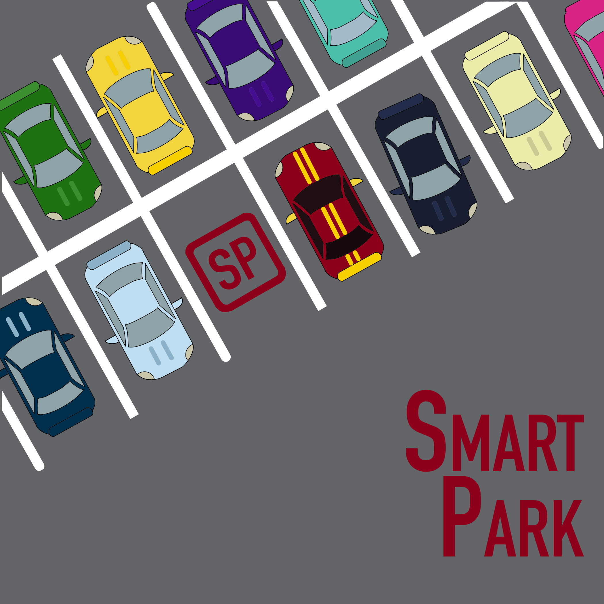
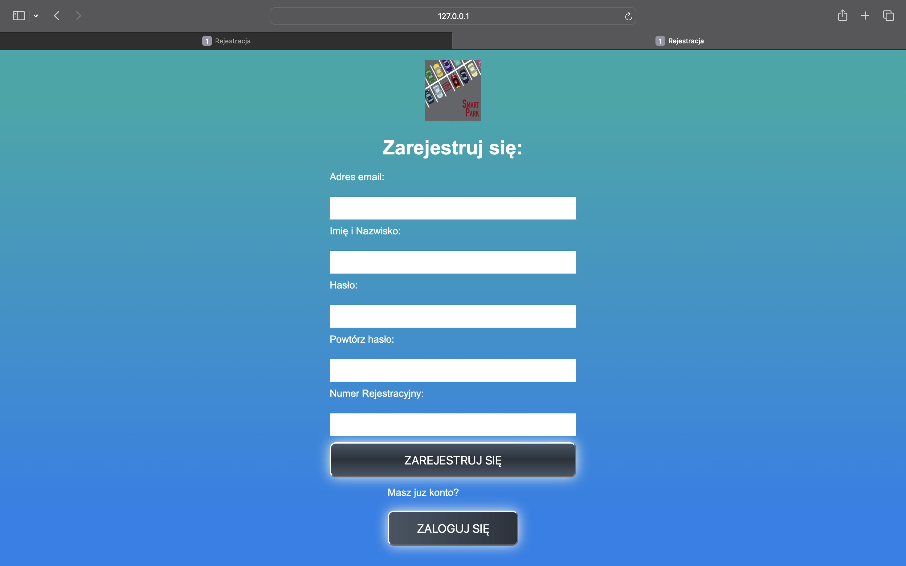
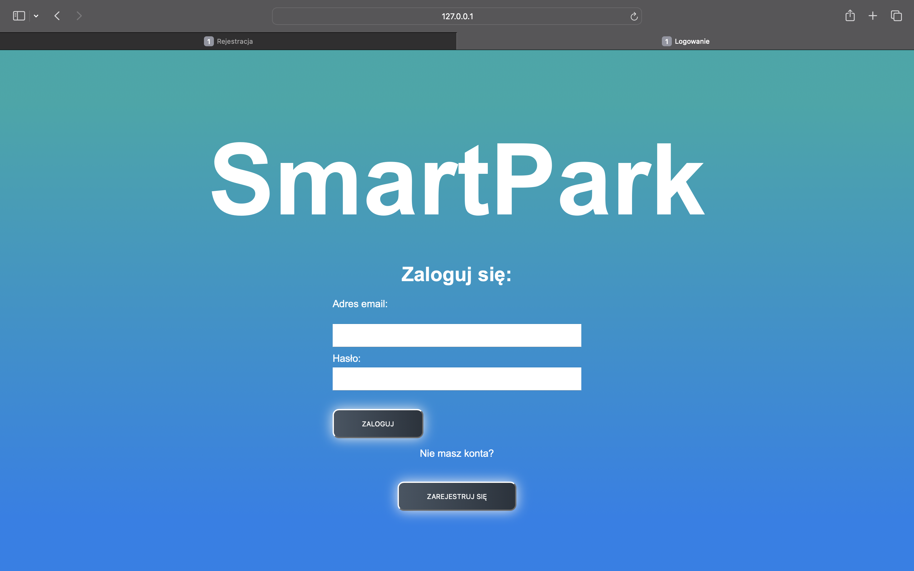
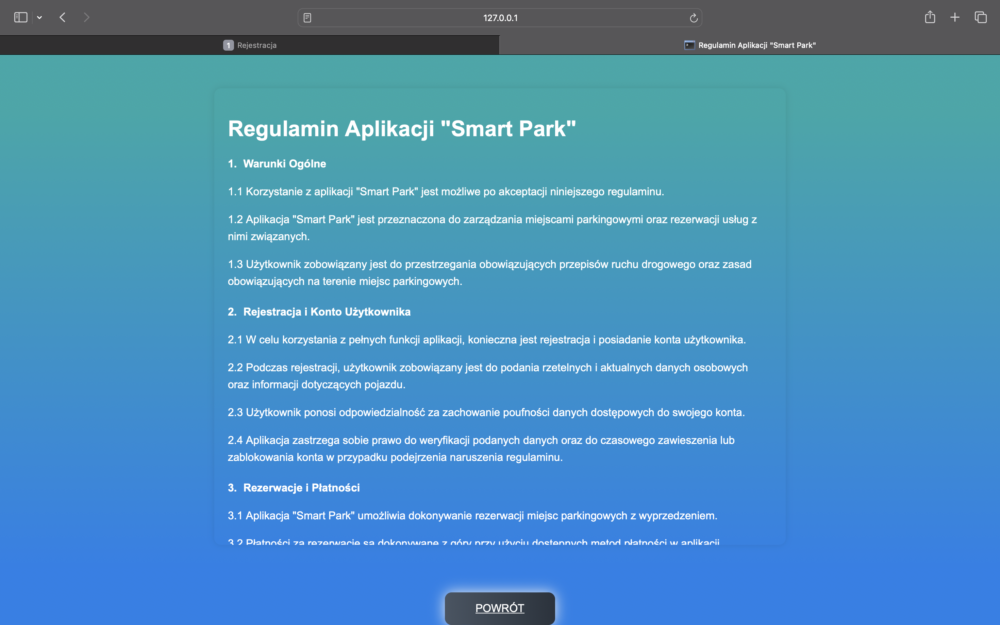
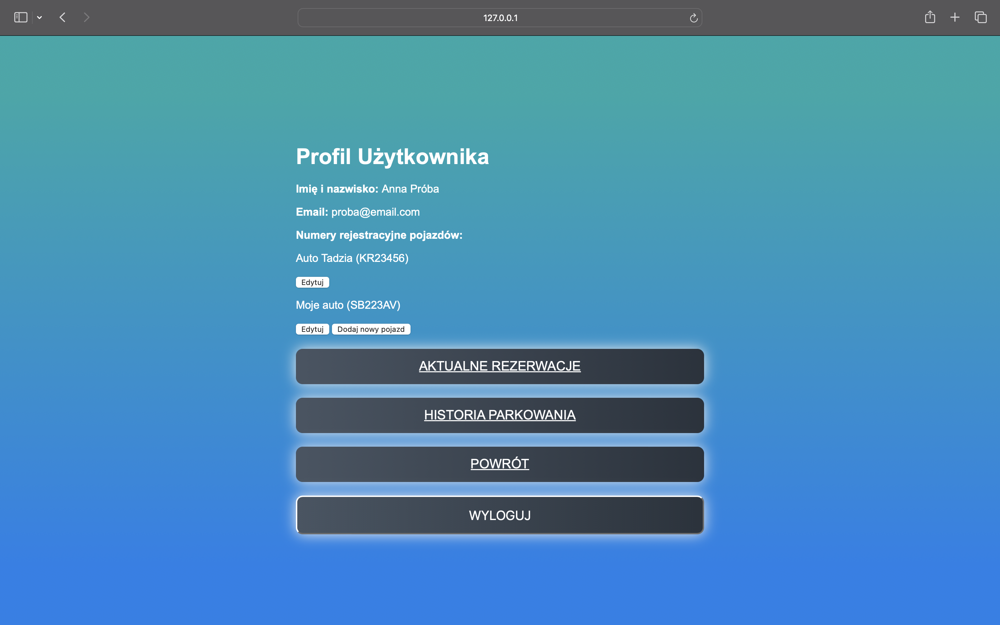
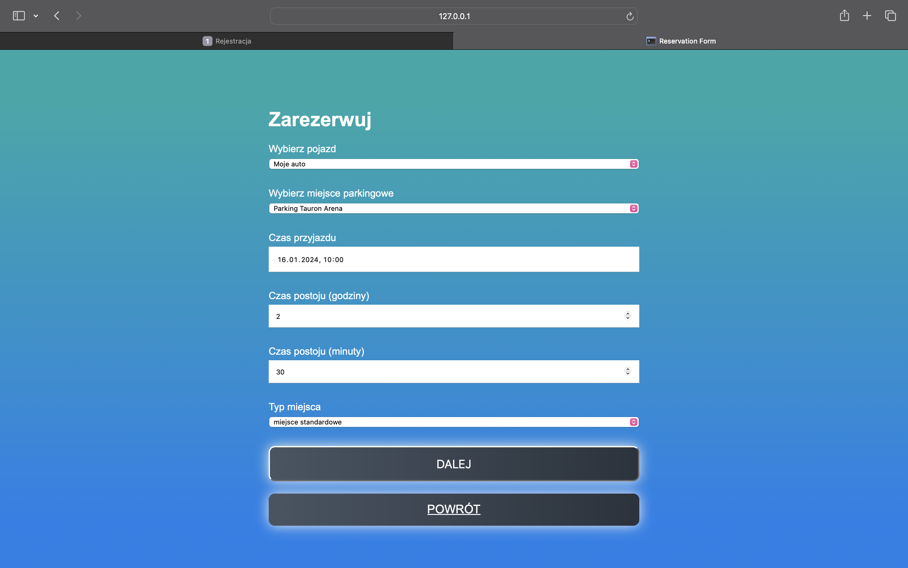
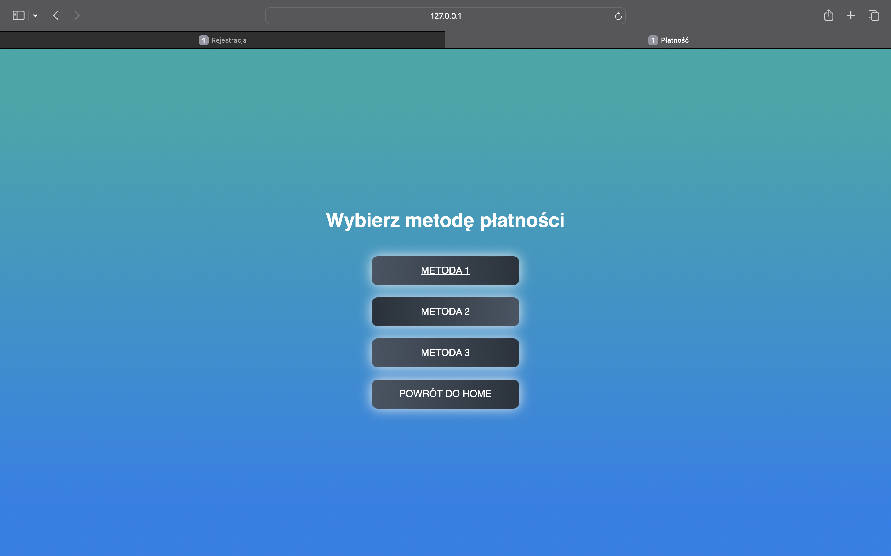
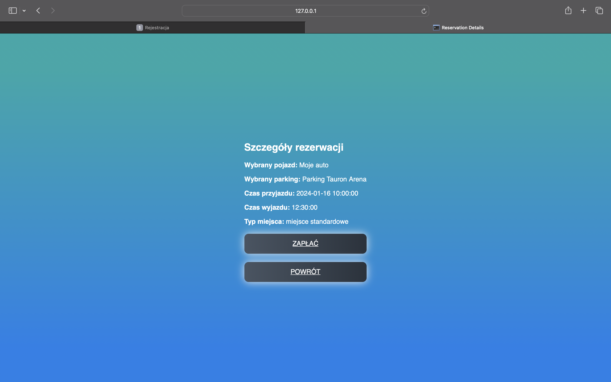
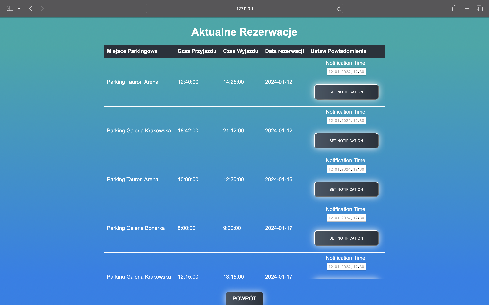
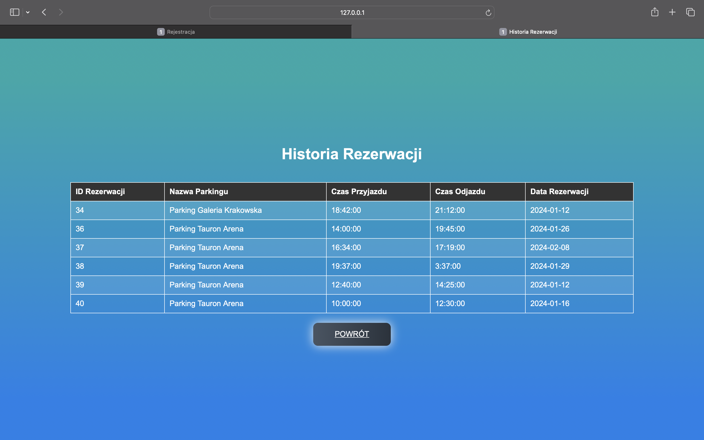

<h1 align="center">

<br>
 Smartpark
<p align="center">

</p>

<br>

<br>

</h1>

<h4 align="center">SmartPark</h4>

<p align="center">
  <a >
   
  </a>
</p>

## Project Overview 🎉

Cel Projektu
Głównym celem projektu było stworzenie aplikacji, która zapewni kierowcom możliwość:
·	Rezerwacji miejsc parkingowych z wyprzedzeniem, co pozwoli zaoszczędzić czas i uniknąć frustracji związanych z brakiem miejsc parkingowych.
·	Dostępu do informacji o dostępności miejsc parkingowych w czasie rzeczywistym, co umożliwi kierowcom planowanie trasy.
·	Wygodnej nawigacji do wybranego parkingu dzięki integracji z mapami.
·	Możliwości płacenia za miejsca parkingowe online, co usprawni proces płatności i zapewni większy komfort.
·	Zdobywania zniżek i korzyści za korzystanie z aplikacji oraz postoju na parkingu.

Projekt skupia się na implementacji kluczowych funkcji, takich jak:
·	Rejestracja Klienta: Umożliwienie klientom rejestracji, co obejmuje wprowadzenie danych kontaktowych.
·	Płatności Online: Obsługa płatności online, pozwalająca klientom opłacać miejsce parkingowe z wyprzedzeniem. Możliwość wyboru różnych opcji płatności, takich jak płatność blikiem, doładowanie konta czy przypisanie karty płatniczej.
·	Zarządzanie Rezerwacjami: Tworzenie systemu zarządzania rezerwacjami, który uwzględnia dostępność miejsc parkingowych i zapisuje rezerwacje klientów.
·	Powiadomienia: Implementacja systemu powiadamiania klientów o zbliżającym się zakończeniu rezerwacji.
·	Nawigacja do Parkingu: Integracja z mapami, umożliwiając nawigację do wybranego parkingu.
·	System Zniżek: Przyznawanie zniżek lub punktów lojalnościowych w zależności od liczby godzin postojowych, które klienci mogą później wykorzystać.
·	Elastyczna Polityka Odwołania Rezerwacji: Możliwość odwołania rezerwacji miejsca parkingowego do określonej godziny przed przyjazdem, z opcją zwrotu niepełnej kwoty.


## Tech/framework used 🔧

| Technologie                                             |                                  

| Aplikacja Smartpark łączy Python, Flask, MySQL oraz HTML/CSS w celu stworzenia funkcjonalnego systemu zarządzania parkingiem opartego na stronie internetowej.|<br>
| [Python](X)                           | Aplikacja została stworzona przy użyciu języka programowania Python.  |<br>
| [Flask](X)                           |  Flask jest frameworkiem webowym dla języka Python, który zapewnia narzędzia i biblioteki do budowy aplikacji internetowych. Jest używany do obsługi trasowania, obsługi żądań oraz renderowania szablonów w tej aplikacji.   |<br>
| [MySQL](X)                           | Aplikacja korzysta z MySQL jako systemu zarządzania bazą danych do przechowywania danych dotyczących przestępstw i użytkowników. Nawiązuje połączenie z serwerem MySQL przy użyciu biblioteki mysql.connector.  |<br>
| [HTML/CSS](X)                           | Front-end aplikacji został zbudowany przy użyciu HTML do strukturyzacji stron internetowych oraz CSS do stylizacji i układu.  |

## Struktura funkcjonalna 🗃️ 

### 🔐 Rejestracja i logowanie

- Rejestracja z walidacją haseł i dodawaniem pojazdu
- Logowanie i przechowywanie sesji użytkownika

### 🚘 Zarządzanie pojazdami

- Dodawanie nowego pojazdu
- Edycja nazwy pojazdu
- Przypisanie pojazdów do użytkownika

### 📅 Rezerwacje

- Rezerwacja miejsca parkingowego z wyborem daty, godziny, typu miejsca
- Pobieranie dostępności miejsc z bazy danych
- Przypisywanie punktów za rezerwacje (+10)
- Szczegóły rezerwacji

### 📈 Historia i aktualne rezerwacje

- Historia rezerwacji z bazy danych
- Przegląd aktualnych rezerwacji (z datą i godziną)
- Ustawianie powiadomienia o zakończeniu rezerwacji

### 🧑 Panel użytkownika

- Widok profilu z danymi użytkownika i pojazdami
- Punkty lojalnościowe
- Regulamin
- Nawigacja po sekcjach aplikacji

---

## 🔒 Baza danych

Uwaga: Aplikacja została pierwotnie zbudowana z wykorzystaniem zewnętrznej bazy danych (udostępnionej przez AGH). Ze względu na utratę dostępu do tej bazy, aktualna wersja nie posiada działającego połączenia z oryginalną bazą.

Kod źródłowy zawiera pełną logikę połączeń, zapytań SQL i zarządzania użytkownikami, rezerwacjami, pojazdami itd.

W przyszłości planowane jest dodanie przykładowej lokalnej bazy danych (np. SQLite lub mocki w mock_data.py) w celu umożliwienia pełnej prezentacji.

Dla celów demonstracyjnych:

Dane dostępowe do bazy zostały zanonimizowane i przeniesione do przykładowego pliku .env.example.

---

## Screenshots 📺

<p align="center">
    
</p>

<p align="center">
    
</p>

<p align="center">
    
</p>

<p align="center">
    
</p>

<p align="center">
    
</p>
<p align="center">
    
</p>
<p align="center">
    
</p>
<p align="center">
    
</p>
<p align="center">
    
</p>
<p align="center">
    
</p>

## 🧪 Uruchomienie lokalne (wersja demonstracyjna)

> **Uwaga**: poniższe kroki przygotowują środowisko do uruchomienia aplikacji lokalnie.

### 1. Klonuj repozytorium

```bash
git clone https://github.com/WozniakI/SmartParkApp
cd smartpark
```

### 2. Utwórz plik .env (dane do bazy)
```bash
cp .env.example .env
```
### 3. Uruchom aplikacje

```bash
python app.py
```

## Informacje dodatkowe 📚

- Projekt realizowany w ramach studiów inżynierskich.
- Aplikacja wykorzystuje sesje, komunikaty Flash, formularze HTML i połączenie z relacyjną bazą danych
- Wersja robocza aplikacji była wykorzystywana do testów z realną bazą danych.
- Projekt został zrealizowany w ramach przedmiotu **Inżynieria oprogramowania** jako praca zespołowa 4-osobowa.

Zakres mojej pracy w projekcie obejmował:  
- implementację backendu aplikacji w Pythonie z wykorzystaniem frameworka Flask,  
- integrację z bazą danych MySQL,  
- obsługę funkcji rejestracji, logowania i zarządzania rezerwacjami,  
- realizację logiki punktów lojalnościowych oraz systemu powiadomień.

Pozostałe osoby w zespole odpowiadały za:  
- projekt i implementację bazy danych,  
- opracowanie dokumentacji projektowej, w tym analizę ryzyk, kosztorys oraz opis wymagań funkcjonalnych.

## Licencja 📜 
Projekt edukacyjny – do użytku własnego, testowego lub demonstracyjnego.


